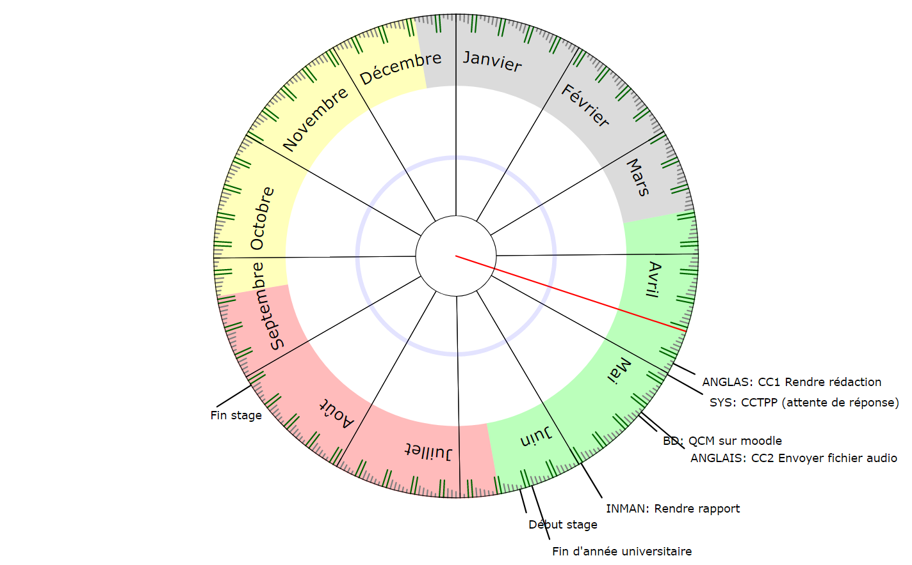

# Calendrier Circulaire HTML5

Une autre manière de voir votre calendrier annuel. 
> Il s'agit d'un POC basique, tout est écrit en un script javascript sans dépendances.

Exemple : https://noxunote.fr/perso/calendar/ (Identification en bas à gauche de la page)

### Présentation
- Affiche l'année parametrée au format circulaire
- Importe et affiche votre agenda Google
- Affiche les week-ends en vert et les jours de la semaine en gris
- Affiche les 4 saisons en couleur
- Facile à paramétrer

### Installation 
- Clonez le projet
- Parametrez dans le script l'année en cours ainsi que la date du premier lundi de l'année
- Créez une API Google calendar dans la console développeur Google
- Ajoutez votre domaine dans la whitelist en tant qu'API web.
- Remplacez les identifiants API_KEY et CLIENT_ID par les votres
- Hébergez les fichiers sur un serveur sous votre domaine whitelisté
